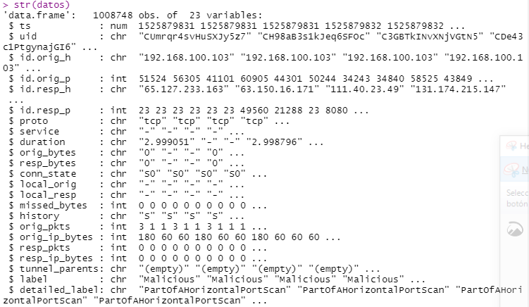

```{r setup, include=FALSE}
knitr::opts_chunk$set(echo = TRUE)
```
## **OBJETIVO**

	- Identificar principales tipo de ataques en IOT
	- Determinar si un evento identificado es benigno o maligno a traves de modelos de predicción (ENTRENANDO CON REGRESION LOGISTICA, ARBOLES DE DECISION Y NAIVE BAYES). 

## **INTRODUCCIÓN**

Internet de las cosas (IoT) es una de las tecnologías líderes en la actualidad y se considera una extensión natural de Internet al incorporar sensores y comunicaciones de máquina a máquina. Las aplicaciones de IoT han aparecido en una variedad de dominios que incluyen atención médica, estado físico, administración de energía en el hogar, automatización de aulas, ciudades inteligentes y muchos más. Una aplicación típica de IoT consta de tres capas; la capa de percepción, la capa de red y la capa de aplicación. La capa de percepción es responsable de detectar y recopilar información sobre el entorno y enviarla a la capa de red. Por ejemplo, las cámaras de vigilancia son un tipo de sensor que reconoce eventos inusuales como el movimiento mediante sensores. La capa de red/transporte se considera un vínculo entre la capa de percepción y la nube. Esta capa consta de muchos protocolos de Internet y tiene que integrar la comunicación.

IoT es vulnerable a los riesgos de seguridad en cada capa arquitectónica y ha enfrentado desafíos de seguridad desde su aparición. Los dispositivos IoT requieren sistemas de autenticación sólidos, que muchos dispositivos IoT no tienen debido a limitaciones de recursos como CPU o limitaciones de energía/batería. La capa de aplicación también está abierta a ataques de virus, gusanos y ataques de phishing.

Uno de los métodos clave para prevenir este tipo de ataques es el despliegue de un sistema de detección de intrusos (IDS) sólido que pueda detectar cualquier tipo de intrusión. Actualmente, los IDS utilizan dos métodos principales para detectar ataques: basados en firmas y basados en anomalías. Los métodos basados en firmas dependen de los ataques conocidos y sus actualizaciones requieren mucho tiempo. Los ataques basados en anomalías, por otro lado, se basan en datos y dependen de que la máquina comprenda el comportamiento normal y rechace.

Como segundo objetivo del proyecto fue la investigación de la aplicación de algoritmos de aprendizaje automático, que es un procedimiento que se ejecuta en datos y se utiliza para crear un modelo de aprendizaje automático listo para la producción, utilizan datos históricos como entrada para predecir nuevos valores de salida. A continuación, una pequeña descripción de los algoritmos de ML utilizados.

**Árbol Decisión**
El algoritmo del árbol de decisiones en el aprendizaje automático es uno de los algoritmos más populares en uso en la actualidad; este es un algoritmo de aprendizaje supervisado que se utiliza para clasificar problemas. Funciona bien clasificando para variables dependientes categóricas y continuas. En este algoritmo, dividimos la población en dos o más conjuntos homogéneos en función de los atributos/variables independientes más significativos.

**Naïve-Bayes**
El algoritmo de clasificación Naive Bayes es un clasificador probabilístico. Se basa en modelos de probabilidad que incorporan fuertes supuestos de independencia. Los supuestos de independencia muchas veces no tienen impacto en la realidad. Por lo tanto, son considerados como ingenuos.

**Regresión Logística**
La regresión logística se utiliza para estimar valores discretos (generalmente valores binarios como 0/1) a partir de un conjunto de variables independientes. Ayuda a predecir la probabilidad de un evento ajustando los datos a una función logit. También se llama regresión logit.


## **METODOLOGÍA**

Este documento utilizó el conjunto de datos IoT-23 (CTU-IoT-Malware-Capture-1-1) archivo **conn.log.labeled** [https://www.stratosphereips.org/datasets-iot23]. Estos datos se basan en el tráfico de red obtenido de dispositivos de Internet de las cosas (IoT) conregistros queevidencian detección de malware y capturas benignas.

Para el presente analisis se han considerado los siguientes pasos:

	- Identificación de las variables
	- Tratamiento de datos perdidos
	- Tratamiento de outliers
	- Transformación de variables
	- Creación de variables dummy
	- Identificación de variables con variancia cero o casi cero
	- Identificación de predictores correlacionados

### **Identificación de las variables**
A continuación se procede con la exploración de datos con la finalidad deidentificar nuestras variables representativas, para estefin leemos los datos de nuestro dataset.

  {withd=40%}
  
En la gráfica se identifica **23 variables** iniciales y **1008748** registros, así como los tipos de variables y datos estadísticos como la media, mediana por cada variable.
Evaluamos la variable target **label Benign y Malicious**. El resultado es el siguiente:

- Benign:      469275 (0.4652) 
- Malicious:   539473 (0.5348)

Evaluamos la variable **detailed_label**. El resultado es el siguiente:

- No info:                       469275
- C&C:                           8
- PartOfAHorizontalPortScan:     539465

Identificamos que el dato identificación de conexión (uid) no es relevante para nuestro estudio por lo tanto procedemos a eliminarlo.


### **Tratamiento de datos perdidos**

En este capitulo vamos explorar datos perdidos para ello nos soportaremos sobre las librerías DataExplorer y VIM.

{withd=20%}

Procedemos a remplazar valores para identificar y visualizar los valores nulos.

{withd=20%}

El análisis del impacto serealiza en base al siguiente cuadro:

{withd=20%}

Se proceda a eliminar las variables (**service, tunnel_parents, local_resp, local_orig**) con alto procentaje de datos faltantes dado que perjudica las interpretaciones (>90%). 

{withd=20%}

Se identifica que existen 819457 registros que tienen uno o mas datos perdidos, existen 2875596 datos perdidos. A continuación se grafica la cantidad de valores perdidos, para visualizar la relacion entre variables.

{withd=20%}
{withd=20%}

De acuerdo al análisis de los gráficos se elimina la columna history que describe el historial de conexión y la columna detailed_label que describe el tipo de captura maliciosa, se elimina la columna detailed_label dado que se tiene el taget en la columna label; todas las candidatas a eliminar no son relevante para nuestro estudio.
Tambien eliminamos la variabla ts que es la marca de tiempo de la captura(de manera correlativa y autoincremental).


### **Imputación de datos pérdidos**

Se evalúan los datos perdidos en la recoleccion de datos, existes los siguientes mecanismo:
**MCAR**: Datos perdidos completamente aleatorio, se recomienda imputacion, eliminar reducirá el tama?o de la muestra, pero no ocasionara sesgo
**MAR**:  Datos perdidos al azar, se recomienda imputacion, no es ideal eliminar, puede conducir a sesgos
**MNAR**: Datos perdidos no aleatorios, no es recomendable la imputacion.

Para el presente caso de estudio seleccionamos el mecanismos **MNAR** para el analisis de las variables de duration, resp_bytes, orig_bytes, missed_bytes. Remplazamos los Nas encontrados con el valor "0" y convertimos los datos a tipo numérico (duration, orig_bytes, resp_bytes).

{withd=20%}

Analizar correlacion entre variables numericas. Según el gráfico de correlación se elimina , orig_pkts y orig_ip_bytes se correlacionan, de manera similar con resp_pkts y resp_ip_bytes.

{withd=20%}

### **Detección de Outliers**
Se analiza como queda la imputación

{withd=20%}

Seevalúa las variables categóricas:

- **proto**         tcp, udp, icmp
- **conn_state**    OTH, REJ, RSTOS0, RSTR, RSTRH, S0, SF, SH 
- **label**         Benign, Malicious


### **Identificación de variables con variancia cero o casi cero**

{withd=20%}

### **Identificación de predictores correlacionados**


